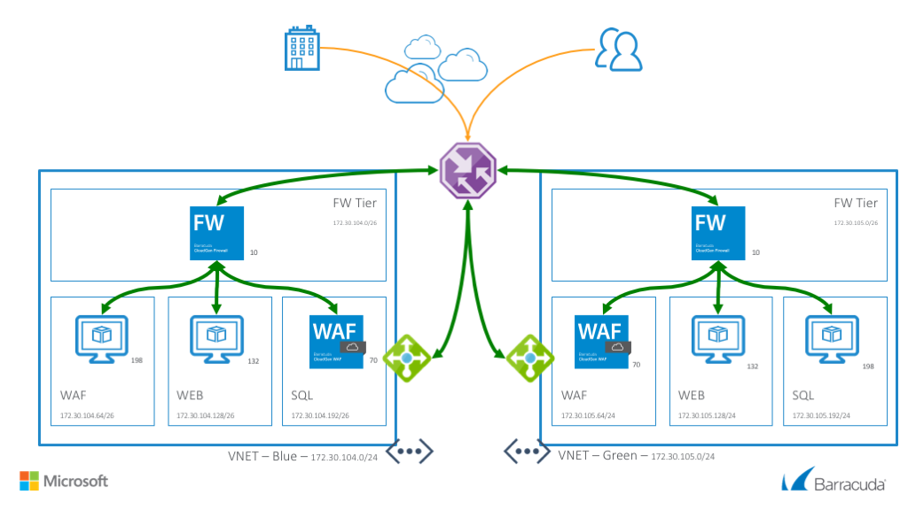

# Barracuda CloudGen Firewall and Web Application Firewall - Blue / Green deployment

## Introduction
Since the start of the begining of time people have tried to automate tasks. Also in computer sience we have seen this from the early days. One limition was the infrastructure that needed to be in place for automation to commence. With virtualisation and public cloud this automation has come full circle and we can now deploy, manage, redeploy everything using automation techniques. We can descibe the operating environment in code, validate it, test it, document it and deploy it from a code repository. 

This is a giant change compared to the typical laborious deployment of infrastructure through cli, web ui, client or other. 

The purpose of this demo is to showcase how you can create, configure and secure your whole environment from code.

## Prerequisites
The tools used in this setup are HashiCorp Terraform and RedHat Ansible. Both tools have their pro's and con's. Working together they help maintaining the state of your infrastructure and the ensures the configuration is correct. The deployment can be done from either a bash shell script or from any CI tool. In our case we used Visual Studio Team Services (VSTS). The LINUX VSTS agent requires the Ansible and Terraform tools to be installed as well as the VSTS agent.

## Deployed resources
Following resources will be created by the template:
- One route table that will route all traffic for networks except for the internal networks to the CGF
- Two Virtual machines with a network interface and public IP in a Availability Set
- One external Azure Standard Load Balancer containing the deployed virtual machines with a public IP and services for IPSEC and TINA VPN tunnels available
- One internal Azure Standard Load Balancer containing the deployed virtual machines 1 load balancing rule directing all UDP and TCP traffic to the active firewall (HA Ports).

**Note** The backend subnets and resources are *not* automatically created by the template. This has to be done manually after template deployment has finished.

## Template Parameters
| Parameter Name | Description
|---|---
adminPassword | Password for the CloudGen Admin tool 
prefix | identifying prefix for all VM's being build. e.g WeProd would become WeProd-VM-CGF (Max 19 char, no spaces, [A-Za-z0-9]
vNetResourceGroup | Resource Group that contains the VNET where the CGF will be installed in
vNetName | The name of the VNET where the CGF will be installed in
subnetNameCGF | The name of the subnet where CGF will be installed
subnetPrefixCGF | Network range of the Subnet containing the CloudGen Firewall (e.g. 172.16.136.0/24)
imageSKU | SKU Hourly (PAYG) or BYOL (Bring your own license)
vmSize | Size of the VMs to be created
fwVMAddressA | Static IP Address of the first CGF VM in Azure
fwVMAddressB | Static IP Address of the second CGF VM in Azure
ccManaged | Is this instance managed via a CloudGen Control Center (Yes/No)
ccClusterName | The name of the cluster of this instance in the CloudGen Control Center
ccRangeId | The range location of this instance in the CloudGen Control Center
ccIpAddress | IP address of the CloudGen Control Center
ccSecret | Secret to retrieve the configuration from the CloudGen Control Center

## Launching the Template

The package provides a deploy.ps1 and deploy.sh for Powershell or Azure CLI based deployments. This can be peformed from the Azure Portal as well as the any system that has either of these scripting infrastructures installed. Or you can deploy from the Azure Portal using the provided link.

## Additional Resources